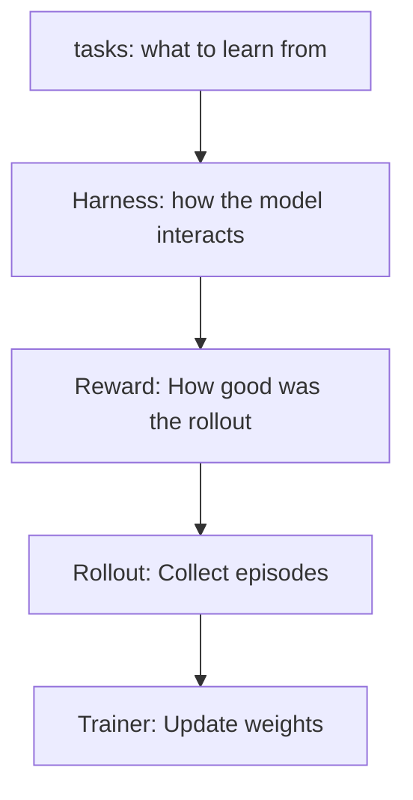

# The ultimate guide to RL environments

### Questions before reading
1. How are the environments created?
2. Are they mined or synthetic?
3. How do you assess the difficulty of each?
### Introduction
* RL is crucial for performance and we've seen a huge buildup of RL environment capability to accommodate longer RL runs (20 envs for [[2025-qwen3]] to ~1M in [[2025-qwen3-5]])
* There exists a bunch of frameworks but they all do pretty much the same thing! (HF spaces, prime-intellect hub, openreward.ai) - I.e. the same RL environments can be built on top of each of the frameworks
![[anatomy-of-a-rl-environment.png]]
* **As of May-2026 there is no common protocol for agents interacting with the RL environment** - hence the comparison article
	* What constitutes an "environment"? (is it just the reward, or is it also the tools, state manager...)
	* Where does the environment run? (locally near the training loop or over HTTPS)
	* How much of the trainer comes with the environment? (some envs come with a training loop e.g. Prime RL, while others require an external runner e.g. HF into TRL)
	* When does the reward fire? (per tool-call? per-step rubric? post-episode verify? external scoring function?)

### Frameworks

| framework | creator              | type                   | package        |
| --------- | -------------------- | ---------------------- | -------------- |
| OpenEnv   | PyTorch              | HTTP (MCP)             | `openenv-core` |
| ORS       | General Reasoning    | HTTP (REST + SSE)      | `ors-sdk`      |
| NeMo Gym  | NVIDIA               | HTTP (REST)            | `nemo-gym`     |
| Verifiers | PrimeIntellect       | In-process python      | `verifiers`    |
| SkyRL Gym | NovaSky-AI (Berkley) | In-process (Gym)       | `skyrl-gym`    |
| GEM       | Axon-RL              | In-process (Gymnasium) | `gem-llm`      |
There are a whole bunch of others (Atropos, Harbor, RLVE, Reasoning Gym, etc. etc. etc.)
#### Tiers of environments
* **Tier 1** - **Pure Task Libraries** -> Just problems + verifiers (no transport, no tools, no state), e.g. RLVE, Reasoning Gym
* **Tier 2** - **Environment frameworks** -> Define how to build an env, but bring your own trainer (OpenEnv, ORS, NeMo Gym, RL Factory)
* **Tier 3** - **Environment + Training bundled** -> Env definition + training in one package (most common: Verifiers, SkyRL Gym, GEM)
### What is an environment (in the RL age)
There is no single canonical implementation, but there is a common shape:
- **Agent:** LLM
- **Environment:** Sandbox that runs shell commands or executes code
- **Action space:** whatever set of tools/frameworks are available
- **Rollout:** multi-turn conversation where the model writes, runs a tool, reads the output, decides what to try next, and eventually submits an answer. The environment scores the reward. Usually N rollouts are performed in parallel.

### RL training system

All RL training loops follow the flowchart above, but the RL frameworks implement different parts of the stack. 

#### What makes a RL environment for LLMs
- Tasks/Dataset: *What problems should the model solve?*
- Initial State Management: *How is per-episode state set up at the start of a rollout?*
- Prompt Template: *How is the task presented to the model?*
- Tool definition(s): *What can the model do in the world?*
- Observation Format: *What does the model see back after an action?*
- Execution Backend: *Where do actions actually run?*
- State Management: *How is state tracked across turns?*
- Reward/Rubric: *How do we score the model's behavior?*
- Done/Termination: *How does the episode end?*
- Episode Control: *Who drives the multi-turn loop and decides when to stop?*
- Transport/Protocol: *How does the model talk to the environment?*

### Dimensions of Comparison
Keeping only the interesting ones! 

#### Dim-2: Communication and deployment
This is the most fundamental architectural split: Does the environment run as a **separate HTTP server** or **inside the training process**? The frameworks split into HTTP Frameworks (OpenEnv, ORS, NeMo Gym) and in-process frameworks (Verifiers, SkyRL Gym, GEM).

The scaling is different obviously, but both mostly outsource all requests to some sandbox provider so in either case the calling layer is very cheap.

#### Dim-3: Tool & Action model
All six frameworks ultimately expose the same thing to the model, a list of callable tools with names, descriptions, and typed parameters. 
* HTTP frameworks define tools on the server and ship a discovery endpoint the client hits at runtime. 
* In-process frameworks define tools as Python functions and register them when the env constructs. 
After discovery, both shapes look identical.

#### Dim-4: Reward architecture
Here more philosophical differences show up, variants:
1. External reward (After rollout) - i.e. the trainer wires up its own reward function
2. Server-embedded (Every tool call) - server attaches a reward to every tool output. Trainer reads the reward without a separate scoring step
3. Post-episode verify (Separate/Verify call) - trajectory runs unscored and trainer hits the `/verify` endpoint
4. **Embedded rubric (Every step) - Composable Rubric object scores each step inline and supports weighted sums and LLM judges** (this somehow makes the most sense to me...)

A note on rewards:
* [[procedural-reward (RL)]]: can be verified deterministically i.e. [[rlvr]]
* [[llm-as-judge-methodology]]: covers cases procedural rewards can't (sometimes called RLAIF), a well designed LLM Rubric can exploit the generator/verifier gap
* [[dense reward (RL)]]/[[sparse reward (RL)]]: separate axis cutting across above two, sparse reward fires only at the end, dense reward fires per step.

## Dim-5: Episode control
Who drives the multi-turn loop, and what tells the episode to stop? Key question is: *does the environment or the trainer own the rollout?*, and another is *who calls the stop?*.

Either the environment owns the *inference* and the full model is loaded there and runs there, or the environment is just something that gets pinged by the trainer at each step! 

The stopping question is actually more interesting than it seems at first glance. You would think trainer-driven makes the most sense - i.e. the trainer calls a `submit_solution()` tool to end the episode. But you might want to have harness-controlled rollouts which are more heavily env-driven. This trains models to be closer to the harnesses they will be deployed in, but the harness work is difficult as it must collect all the relevant stats.

### Concluding thoughts:
1. Good article which is really focused on the "framework" question, i.e. what design choices go into designing such a framework
2. Much less into actual RL, or how to construct/generate good RL environments (+ curriculums)
3. Interesting to see the different dimension breakdown of the current ecosystem, but the differences seem minute (to my naive view), and each different setup requires a great amount of excellent engineering to make work at scale (e.g. trainer + orchestration + sandbox infra, and so on..)
4. Nice comparison across all axes at the end of the article
---
## Source
- Original URL: <https://huggingface.co/spaces/AdithyaSK/rl-environments-guide>
